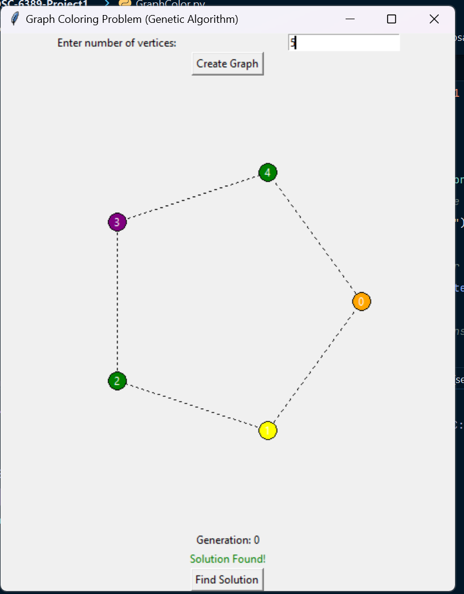

# UTPB-COSC-6389-Project1

This project addresses three classic computational problems using optimization algorithms: the Traveling Salesman Problem (TSP), the Knapsack Problem, and the Graph Coloring Problem. Each algorithm has been enhanced and optimized for improved solution quality, efficiency, interactivity, and user experience.

## Problem Summaries and Enhancements

### Traveling Salesman Problem (TSP)

**Description**  
The TSP seeks the shortest possible route that visits a list of cities and returns to the starting point. This project implements a simulated annealing-based approach, optimized for more efficient and accurate results.

**Enhancements and Contributions**  
- **Solution Quality**: Originally used only basic Simulated Annealing, now enhanced with 2-Opt optimization to improve local adjustments and path quality.
- **Initialization**: Updated from a random path to a Nearest-Neighbor Heuristic for a high-quality starting path.
- **Efficiency**: Optimized the cooling rate and temperature settings, which reduces the iteration count for faster convergence.
- **Interactivity**: Added a feature allowing users to dynamically generate points and observe real-time updates.
- **Solver Selection**: Implemented an option to choose between Simulated Annealing and Ant Colony Optimization.
- **Readability and Modularity**: Restructured code to be modular, making it more organized and easier to read.

### Knapsack Problem

## Features & Enhancements

### 1. **Fitness Function Enhancement**
   - The fitness function has been upgraded from an absolute difference from the target value to a **scaled normalization**. This adjustment reduces bias and ensures more consistent performance throughout the search process, improving convergence towards the optimal solution.

### 2. **Selection Method: Tournament Selection**
   - The selection method has been updated from a weighted selection approach to **tournament selection**. Tournament selection promotes diversity in the population and prevents premature convergence to local optima, helping the algorithm explore a broader range of possible solutions.

### 3. **Crossover Method: Uniform Crossover**
   - The crossover method has been changed from a **single-point crossover** to **uniform crossover**, which increases genetic diversity by allowing more flexible combinations of genes between parent solutions. This ensures a better mix of traits and fosters more exploration of the solution space.

### 4. **Mutation Method: Multi-point Mutation**
   - The mutation method has been enhanced with **multi-point mutation**. This technique introduces random changes at multiple points in the genome, enabling the algorithm to escape local minima and explore a larger portion of the search space, leading to more robust solutions.

### 5. **Elitism: Selective Elitism**
   - The elitism strategy has been modified from simple elitism (retaining the best solutions) to **selective elitism**, where only the top individuals are carried over to the next generation. This approach strikes a balance between preserving high-quality solutions and maintaining population diversity.

### 6. **UI Updates: Asynchronous Updates**
   - The user interface has been optimized to use **asynchronous updates** with `self.after()`. This provides smoother, more responsive UI interactions by preventing blocking during the GA process, allowing real-time updates of the best solutions and generation progress without freezing the interface.
### Graph Coloring Problem

**Description**  
This program applies a genetic algorithm to solve the Graph Coloring Problem, where the goal is to assign colors to vertices such that no adjacent vertices share the same color.
(Note: Adjacent Vertices are connect by a dashed line. The line should be red if the adjacent vertices are same color, showing conflict
)

# Algorithm Details and Contributions

- **Initialization**:  
  The algorithm begins with a randomly generated population of chromosomes, where each chromosome represents a possible color assignment for all vertices. The number of colors is determined by the total number of vertices in the graph.

- **Fitness Evaluation**:  
  Fitness is evaluated based on the number of edge conflicts, where adjacent vertices having the same color incur a penalty. The algorithm aims to minimize these conflicts, with the goal of achieving a solution where no two adjacent vertices share the same color (fitness = 0).

- **Selection**:  
  **Roulette Wheel Selection** is used to probabilistically select individuals from the population based on their fitness. Individuals with fewer conflicts (lower fitness values) have a higher chance of being selected, ensuring that better solutions are more likely to be carried forward in the next generation.

- **Crossover**:  
  The algorithm uses **two-point crossover** to combine the genetic material of two parent chromosomes. This technique facilitates the exchange of color assignments between parents at two random points, increasing diversity and helping the algorithm avoid getting stuck in local optima.

- **Targeted Mutation**:  
  The algorithm applies **targeted mutation**, which focuses on modifying specific chromosomes that are less fit. Rather than applying a random mutation across the entire chromosome, the algorithm selects vertices and swaps their colors with a probability that adapts over generations. Early generations use higher mutation rates to encourage exploration of diverse solutions, while later generations lower the mutation rate to refine and exploit promising colorings.

- **Termination and Real-Time Feedback**:  
  The algorithm terminates early if a solution with zero conflicts is found, providing real-time feedback on progress. The generation counter is updated continuously to track the evolution of the population. If no solution is found after 200 generations, the algorithm outputs the best solution discovered.

## UI Navigation

## User Interface Components

1. **Vertex Input Field**:
   - **Label**: "Enter number of vertices:"
   - **Input Box**: Enter the desired number of vertices for your graph.

2. **Create Graph Button**:
   - **Button**: **Create Graph**
   - Click this button to generate a random graph based on the number of vertices specified. This action resets the canvas, allowing for new graph inputs.

3. **Graph Visualization Canvas**:
   - **Canvas**: Displays the graph visually with vertices and edges.
   - Initially, vertices are shown in gray, indicating that they have not been colored.

4. **Generation Counter**:
   - **Label**: "Generation: 0"
   - Displays the current generation count as the genetic algorithm runs.

5. **Solution Status Label**:
   - **Label**: (initially empty, will display solution status)
   - This label shows messages such as "Solution Found!" when a valid coloring solution is achieved.

6. **Find Solution Button**:
   - **Button**: **Find Solution**
   - Click this button to start the genetic algorithm. The algorithm will attempt to find a valid color assignment for the graph, updating the visualization as it progresses.

## User Interface Components

1. **Vertex Input Field**:
   - **Label**: "Enter number of vertices:"
   - **Input Box**: Enter the desired number of vertices for your graph.

2. **Create Graph Button**:
   - **Button**: **Create Graph**
   - Click this button to generate a random graph based on the number of vertices specified. This action resets the canvas, allowing for new graph inputs.

3. **Graph Visualization Canvas**:
   - **Canvas**: Displays the graph visually with vertices and edges.
   - Initially, vertices are shown in gray, indicating that they have not been colored.

4. **Generation Counter**:
   - **Label**: "Generation: 0"
   - Displays the current generation count as the genetic algorithm runs.

5. **Solution Status Label**:
   - **Label**: (initially empty, will display solution status)
   - This label shows messages such as "Solution Found!" when a valid coloring solution is achieved.

6. **Find Solution Button**:
   - **Button**: **Find Solution**
   - Click this button to start the genetic algorithm. The algorithm will attempt to find a valid color assignment for the graph, updating the visualization as it progresses.

7. **Restart Button**:
   - **Button**: **Restart**
   - After the algorithm finds a solution, the **Restart** button becomes enabled. Click this button to reset the application, allowing you to input a new number of vertices and generate a fresh graph. This will also reset the solution status, generation counter, and graph canvas.

## Using the Application

1. **Input the Number of Vertices**:
   - Type in the desired number of vertices in the input field.

2. **Generate the Graph**:
   - Press the **Create Graph** button. The canvas will refresh and display a new random graph.

3. **Start the Coloring Algorithm**:
   - Click the **Find Solution** button to begin the genetic algorithm process. The generation count will update in real-time.

4. **Monitor the Progress**:
   - Observe the graph as the algorithm works towards finding a solution. If a solution is found, the canvas will update to show the colored vertices, and the solution status label will indicate success.

5. **Restart**:
   - Once a solution is found, the **Restart** button will be enabled. Click the **Restart** button to reset the application, allowing you to input new values and start the process again.

---

